# 게임형 주식 교육 서비스 “Returnz”

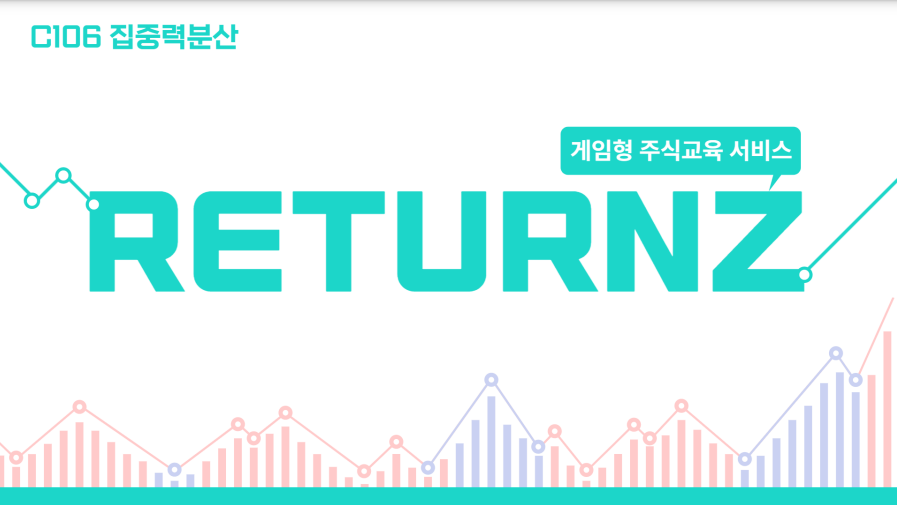

## 프로젝트 소개

- 프로젝트 영상

[[SSAFY 8기 특화PJT] Returnz 리턴즈 서비스 소개 영상_광주1반_C106](https://youtu.be/Zr3y8O6Xzkc)

```jsx

```
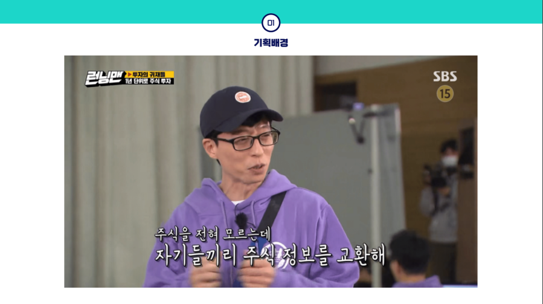
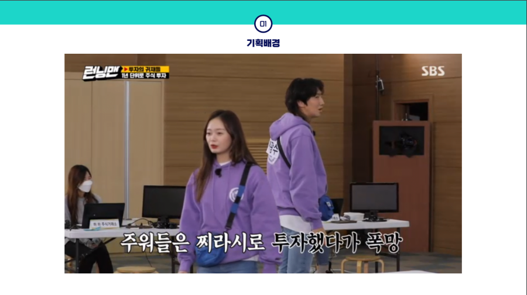
## 서비스 소개

### 1. 메인 화면 / 사이드 바

- 달러 환율, 엔 환율, 비트코인 가격 등의 정보를 알 수 있다.
- 오늘의 추천 종목을 받을 수 있다.
- 듀토리얼을 진행할 수 있다.
- 수익률 Top 10 유저를 볼 수 있다.
- 오늘의 추천 종목을 받을 수 있다.
- 친구들의 접속 상태를 파악할 수 있다.
- 친구 추가를 할 수 있다.
- 게임 초대를 수락할 수 있다.
- 게임방을 개설할 수 있다.

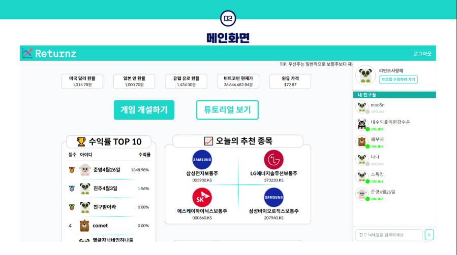

## 

### 2. 게임 대기 방

- 지정한 테마의 데이터를 바탕으로 게임 대기 방을 생성한다.
- 게임 대기방 참가자끼리 채팅할 수 있다.
- 코로나 바이러스, 닷컴 버블등 다양한 테마를 제공한다.
- 사용자 설정 테마를 적용할 경우, 시작 날짜와 Turn을 세팅할 수 있다.
- 각 참가자들은 자신의 평균 수익율를 알 수 있다.

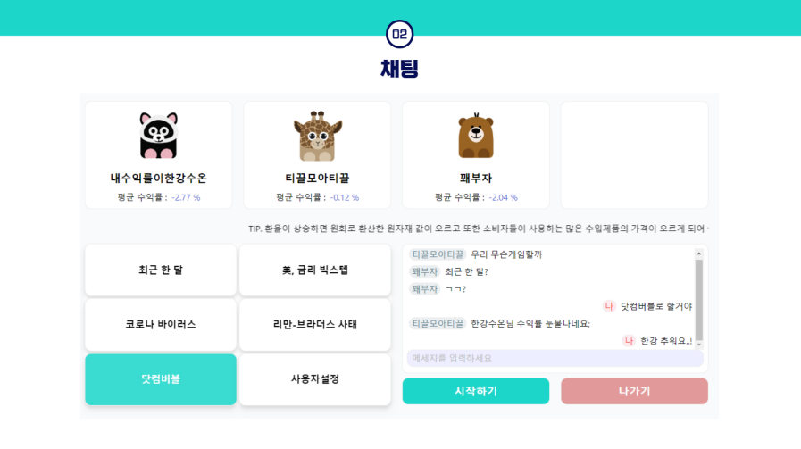

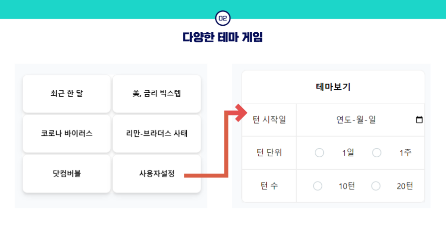
### 3. 게임 진행

1. 주가 정보를 캔들형 그래프로 확인할 수  있다.
2. 게임방 내 인원들과 채팅할 수 있다.
3. 10 종목에 대한 정보를 제공한다.
4. 주식을 매수/매도 할 수 있다. 외국 주식의 경우 자동적으로 환율이 적용된다.
5. 매수/매도 시 로그를 생성한다.
6. 턴 정보가 업데이트 되면 해당 턴에대한 정보를 로그로 저장한다.
7. 각 종목에 대한 주가정보를 제공한다.
8. 뉴스 데이터를 제공한다.
9. 게임방 내 인원들의 정보를 동기화 한다.
10. 도움말 기능을 제공한다.
11. 게임방 내 인원들의 순위를 확인할 수 있다.

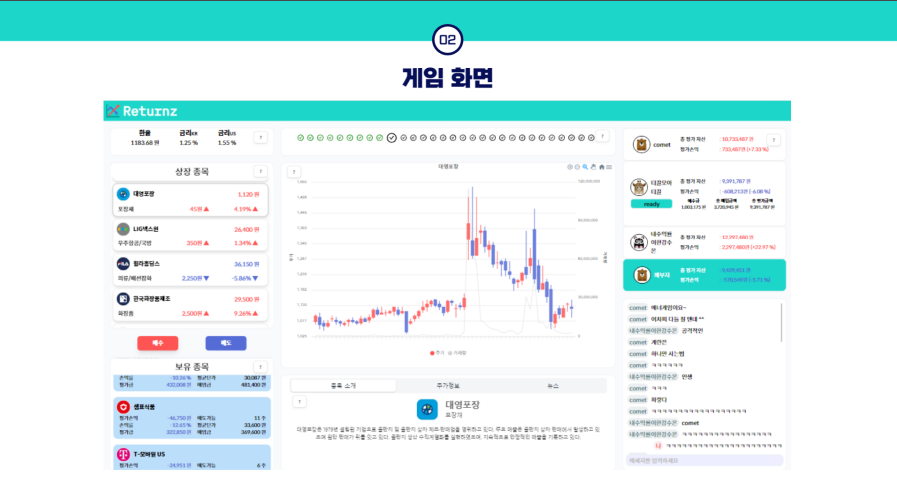

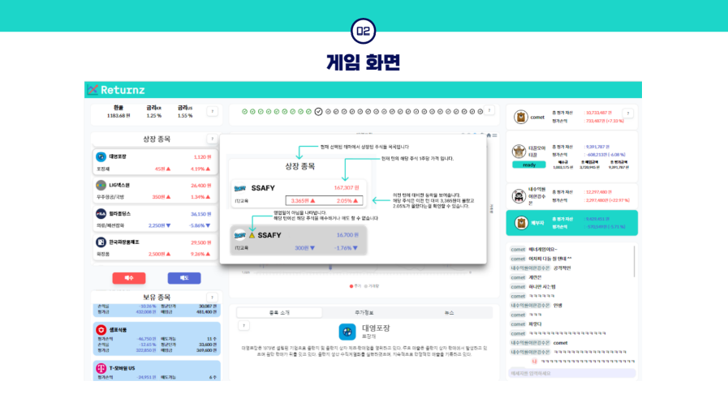

### 4. 게임 결과 화면

1. 최종 순위를 확인할 수 있다.
2. 매수/매도 기록을 볼 수 있다.
3. 수익률 변화 그래프를 볼 수 있다.
4. 다른 사용자의 기록을 볼 수 있다.
5. 결과 화면에 있는 사용자들끼리 채팅할 수 있다.

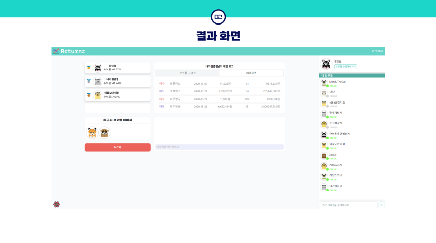

# 시스템 아키텍처

- CloudCraft

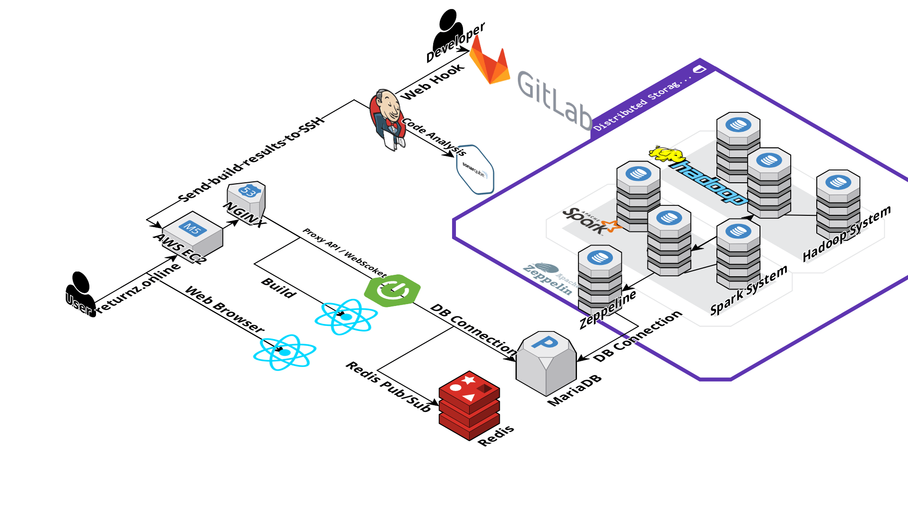

- Figma

[https://www.figma.com/file/UD3T6CivI3wO4wQTH2ceRn/%EC%A7%91%EC%A4%91%EB%A0%A5%EB%B6%84%EC%82%B0-FIGMA?node-id=104-3](https://www.figma.com/file/UD3T6CivI3wO4wQTH2ceRn/%EC%A7%91%EC%A4%91%EB%A0%A5%EB%B6%84%EC%82%B0-FIGMA?node-id=104-3)

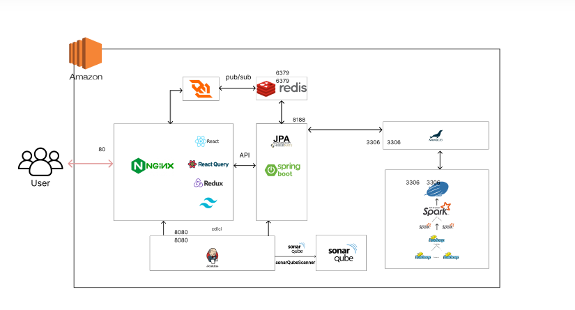

## 부하테스트

- 분산 처리 시스템(Docker) Run 상태에서 부하 테스트
    - 부하테스트 결과
        
        ### 부하 테스트 진행 방식
        
        - 게임방을 미리 생성해둔 채로 진행.
        - 닉네임 조회, 게임 생성, 게임 조회를 수행하도록 함.
        - 게임방 생성을 계속해서 해줘야 하므로, 한번의 테스트로 Insight를 얻을 수 있도록 Number of Users, spawn rate를 조정
        
        ### 부하 테스트
        
        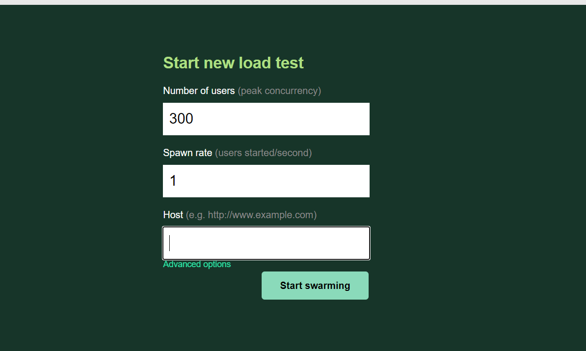
        
        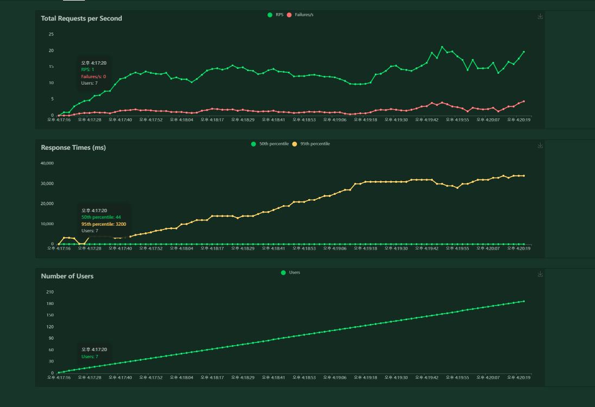
        
        ### 수행 결과
        
        - Total Request per Second를 분석하면 제일 작은 RPS는 10.3 이였다.
        - 최대 RSP는 약 15이다.
        - Failure는 닉네임 조회, 로그인, 메인 화면 진입시에 발생했다.
        - Response time 50th percentile은 16 ~ 18사이로 균등하다
        - Response time 95th percentile은 꾸준히 증가한다. (3200ms ~ 34000ms)
        - Response Time 95th percentile이 줄어들다 증가하는 구간의Number of Users는 33이다.
        - 해당 경우의 Response Time 95th percentile은 4600ms이다.
        
        ### 분석 결과
        
        - 게임 진행 시 처리해야 하는 데이터가 많기 때문에 응답시간이 어느정도 낮다는 걸 고려한 결과 최대 처리할 수 있는 유저의 수는 33명이라 가정한다.
        - locust에서는 3, 5초 사이로 Task를 수행하도록 설정했지만, 실제 게임에서는 이보다 긴 1분 이내에서 Task가 수행되기때문에 테스트 보다 안정적일 것이라 생각한다.
- 분산 처리 시스템(Docker) Stop  상태에서 부하 테스트
    - 부하테스트 결과
        
        
        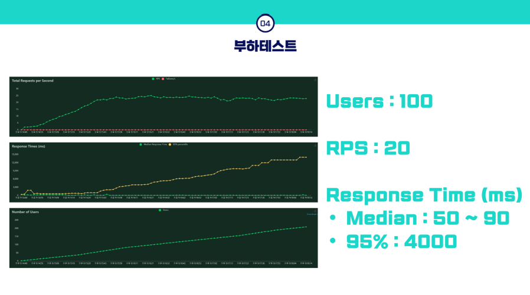
        
        - 게임 진행 시 턴을 넘기지 않도록 설정하고, 부하테스트를 진행했다.
        - 분산 저장을 위해 사용했던 hadoop, spark, zeppeline 등을 stop 시킨 후 진행했다.
            
            ### AWS EC2 성능
            
            - xeon 2676v3 Siblings : 4
            
            ### 결과
            
            
            
            - RPS는 22
            - 95% 4500ms되는 구간의 유저수는 99명
            - 게임의 원활한 진행을 위한 시간이 5000ms라고 가정한다면, 최대 103명 까지 가능하다.
